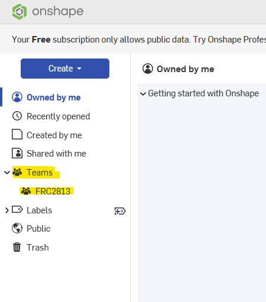

# AdvantageKit-LePrawn experiment

## Importing Robot CAD models in Advantage Scope

Follow the video tutorial from https://docs.advantagescope.org/more-features/custom-assets/#3d-robot-models.

To find the `LePrawn` CAD models, make sure you have an account in [onshape](https://www.onshape.com/), and that you are included in the FRC 2813:

Browse through the `FRC2813`'s 2025-2026 directory and find the CAD plans for the `LePrawn` robot.
Locate the `0 Master` plan, open the `Block CAD` tab and download the plans of indivudual parts one at a time (and not the whole robot with all its parts as one file). Download and use the CAD assistant application described in this [page](https://docs.advantagescope.org/more-features/custom-assets/gltf-convert) to convert the downloaded models into `.glb` format.

NOTES:

* We prefer the `Block CAD` models over more detailed models because these models are much smaller in size (mere KBs) and load much faster in Advantage Scope.
* Other CAD models would work eventually too, but they can go up in the 100s of MB and take a lot more to load and render.

Finally, follow the `model.glb`, `model_0.glb`, `model_1.glb`, ... naming convention as per video tutorial, and work on the `config.json` to make all of the subcomponents load in AdvantageScope.

NOTE: If the files are not exported in the proper format, named incorrectly, or `config.json` is invalid, Advantage Scope will print a message `Some asset files failed to load.`. Start simple (e.g. just with `model.glb`) and keep adding components one at a time.

To troubleshoot asset loading failures, open the `Developer Tools` to investigate error messages in the Advantage Scope `Console`.

NOTE: To point AdvantageScope to the `.glb` files we have in the robot repository, go to `Help -> Use Custom Asset Folder` and point it to the `advantage_scope_robots` subfolder in the repository.
